# Лабораторная работа №1

Loki + Zabbix + Grafana

## Задача

Подключить к тестовому сервису Nextcloud мониторинг + логирование. Осуществить визуализацию через Grafana

## Ход работы

### Подготовка к работе

1. Создадим отдельные поддомены для каждого сервиса: `nextcloud.*`, `loki.*`,
   `grafana.*`, `zabbix.*`.
2. Также установим на сервер Docker, nginx.

### Логирование

1. Для начала настроим сервер. Необходимо установить все необходимые приложения: `docker`, `nginx`.
2. Отредактируем `docker-compose.yml` таким образом, чтобы сервисы работали только на localhost:

```yaml
services:
  nextcloud:
    image: nextcloud:29.0.6
    container_name: nextcloud
    ports:
      - "127.0.0.1:8080:80"
    volumes:
      - nc-data:/var/www/html/data

  loki:
    image: grafana/loki:2.9.0
    container_name: loki
    ports:
      - "127.0.0.1:3100:3100"
    command: -config.file=/etc/loki/local-config.yaml

  promtail:
    image: grafana/promtail:2.9.0
    container_name: promtail
    volumes:
      - nc-data:/opt/nc_data
      - ./promtail_config.yml:/etc/promtail/config.yml
    command: -config.file=/etc/promtail/config.yml

  grafana:
    environment:
      - GF_PATHS_PROVISIONING=/etc/grafana/provisioning
      - GF_AUTH_ANONYMOUS_ENABLED=true
      - GF_AUTH_ANONYMOUS_ORG_ROLE=Admin
    command: /run.sh
    image: grafana/grafana:11.2.0
    container_name: grafana
    ports:
      - "127.0.0.1:3000:3000"

  postgres-zabbix:
    image: postgres:15
    container_name: postgres-zabbix
    environment:
      POSTGRES_USER: zabbix
      POSTGRES_PASSWORD: zabbix
      POSTGRES_DB: zabbix
    volumes:
      - zabbix-db:/var/lib/postgresql/data
    healthcheck:
      test: [ "CMD", "pg_isready", "-U", "zabbix" ]
      interval: 10s
      retries: 5
      start_period: 5s

  zabbix-server:
    image: zabbix/zabbix-server-pgsql:ubuntu-6.4-latest
    container_name: zabbix-back
    ports:
      - "127.0.0.1:10051:10051"
    depends_on:
      - postgres-zabbix
    environment:
      POSTGRES_USER: zabbix
      POSTGRES_PASSWORD: zabbix
      POSTGRES_DB: zabbix
      DB_SERVER_HOST: postgres-zabbix

  zabbix-web-nginx-pgsql:
    image: zabbix/zabbix-web-nginx-pgsql:ubuntu-6.4-latest
    container_name: zabbix-front
    ports:
      - "127.0.0.1:1651:8080"
    depends_on:
      - postgres-zabbix
    environment:
      POSTGRES_USER: zabbix
      POSTGRES_PASSWORD: zabbix
      POSTGRES_DB: zabbix
      DB_SERVER_HOST: postgres-zabbix
      ZBX_SERVER_HOST: zabbix-back

volumes:
  nc-data:
  zabbix-db:
```

3. Далее создадим файл конфигурации nginx для того, чтобы был прокси-сервер, который будет пропускать IP из вайтлиста:

```nginx
# Nextcloud Proxy
server {
    listen 80;
    server_name nextcloud.hellkirl-dev.ru;

    allow xxx.xxx.xxx.xxx;
    deny all;

    location / {
        proxy_pass http://localhost:8080; # Nextcloud container
        proxy_set_header Host $host;
        proxy_set_header X-Real-IP $remote_addr;
        proxy_set_header X-Forwarded-For $proxy_add_x_forwarded_for;
        proxy_set_header X-Forwarded-Proto $scheme;
    }
}

# Loki Proxy
server {
    listen 80;
    server_name loki.hellkirl-dev.ru;

    allow xxx.xxx.xxx.xxx;
    deny all;

    location / {
        proxy_pass http://localhost:3100; # Loki container
        proxy_set_header Host $host;
        proxy_set_header X-Real-IP $remote_addr;
        proxy_set_header X-Forwarded-For $proxy_add_x_forwarded_for;
        proxy_set_header X-Forwarded-Proto $scheme;
    }
}

# Grafana Proxy
server {
    listen 80;
    server_name grafana.hellkirl-dev.ru;

    allow xxx.xxx.xxx.xxx;
    deny all;

    location / {
        proxy_pass http://localhost:3000; # Grafana container
        proxy_set_header Host $host;
        proxy_set_header X-Real-IP $remote_addr;
        proxy_set_header X-Forwarded-For $proxy_add_x_forwarded_for;
        proxy_set_header X-Forwarded-Proto $scheme;
    }
}

# Zabbix Proxy
server {
    listen 80;
    server_name zabbix.hellkirl-dev.ru;

    allow xxx.xxx.xxx.xxx;
    deny all;

    location / {
        proxy_pass http://localhost:1651; # Zabbix Web container
        proxy_set_header Host $host;
        proxy_set_header X-Real-IP $remote_addr;
        proxy_set_header X-Forwarded-For $proxy_add_x_forwarded_for;
        proxy_set_header X-Forwarded-Proto $scheme;
    }
}
```

4. Запустим Docker Compose:
   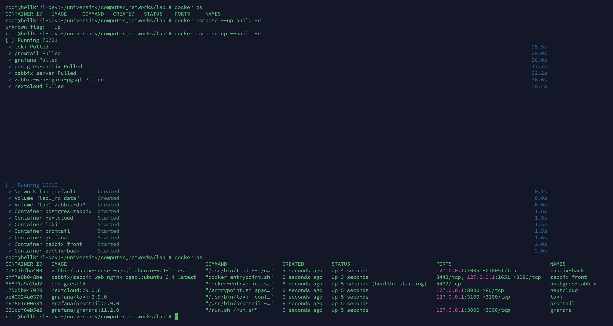

5. Теперь необходимо настроить Nextcloud. Зарегистрируемся в сервисе, а также проверим, что Promtail подцепил логи:
   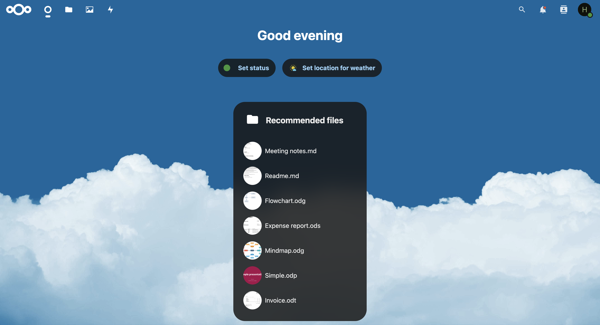
   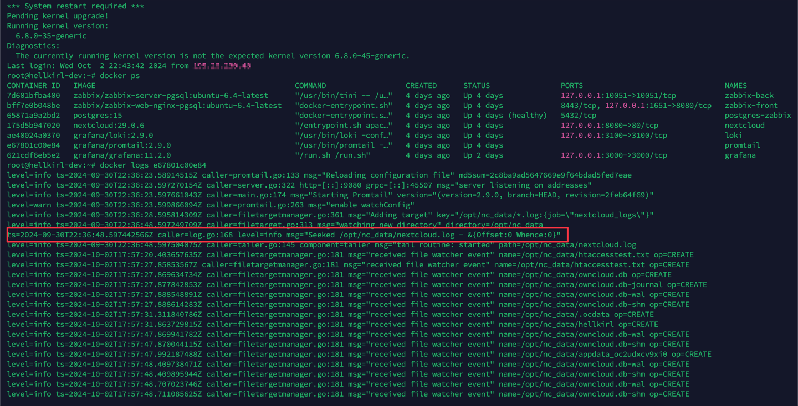

### Мониторинг

1. Начнем настройку Zabbix:
   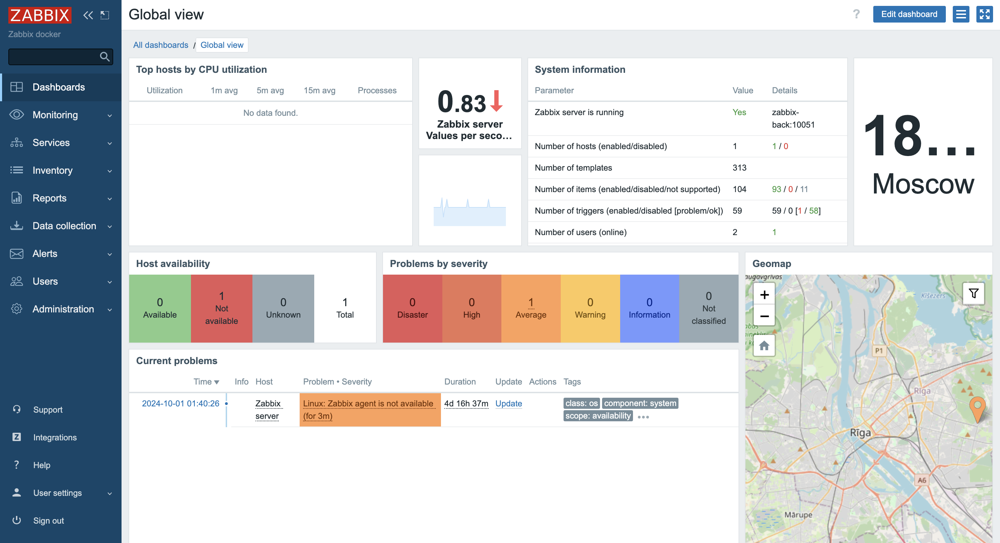
2. Добавим шаблон для мониторинга Nextcloud:
   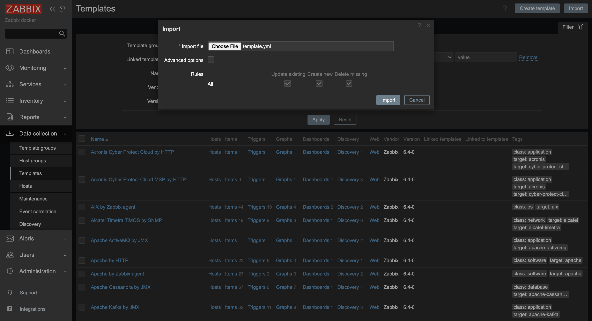
3. Разрешим обращаться к контейнеру Nextcloud из контейнера Zabbix:
   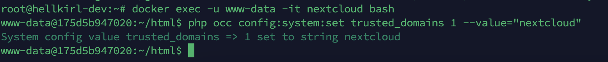
4. Добавим хост в Zabbix и посмотрим на результат мониторинга:
   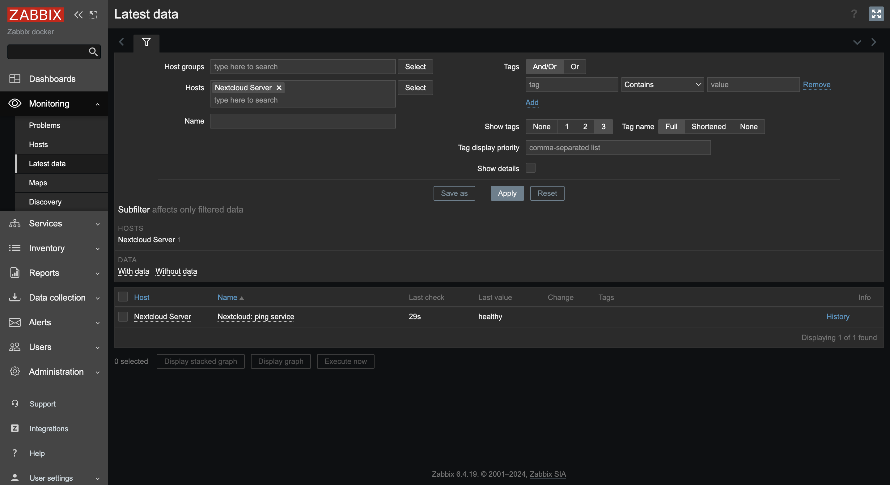

### Визуализация

1. Установим плагин для графиков в Grafana:
   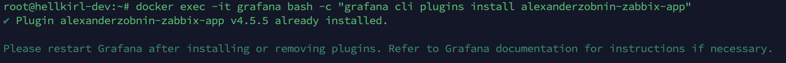
2. Добавим Loki в качестве источника данных:
   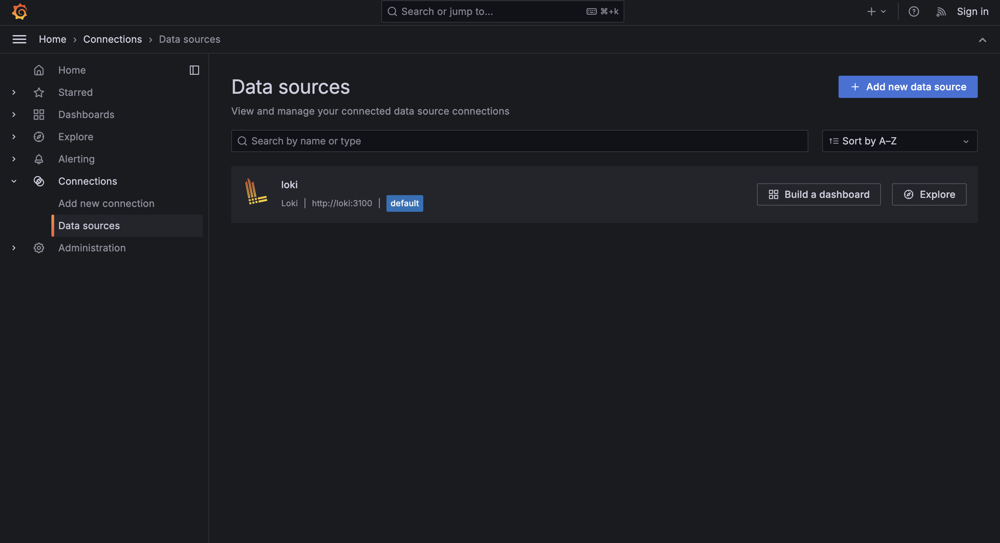
3. Добавим Zabbix в качестве источника данных:
   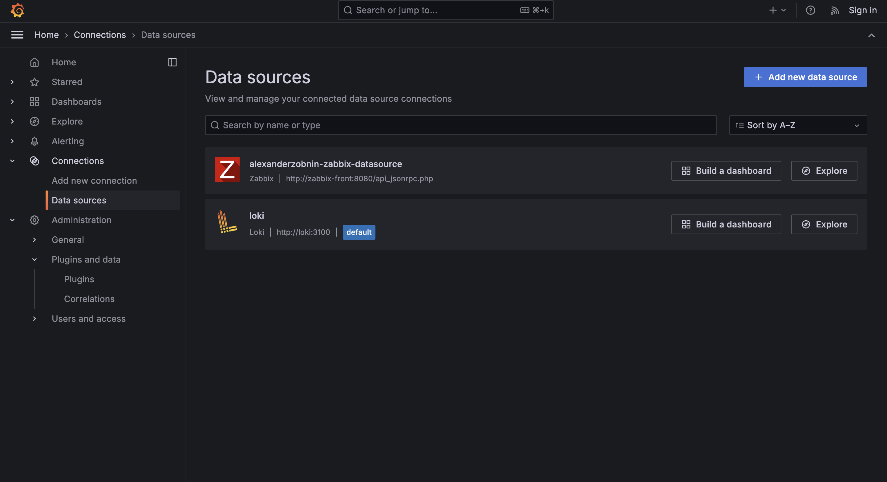
4. Создадим дашборд для мониторинга и добавим графики:
   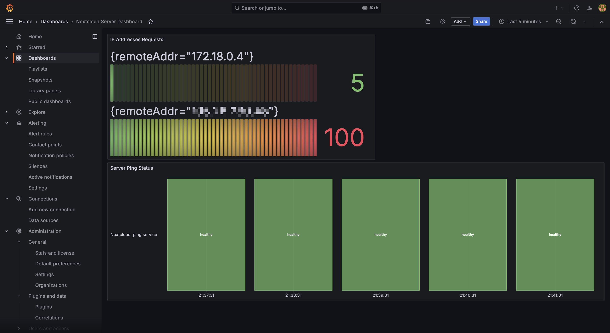