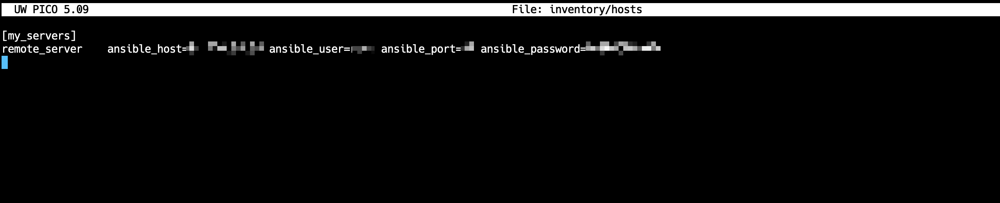
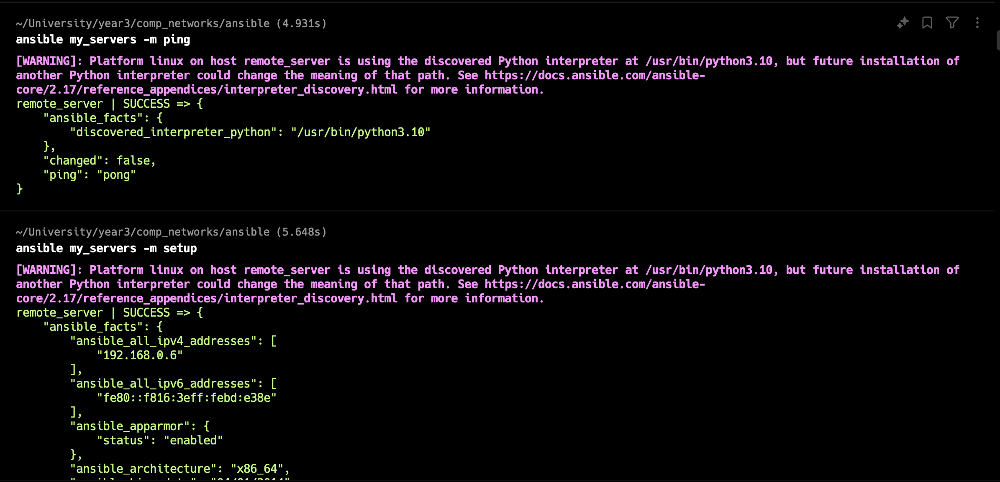
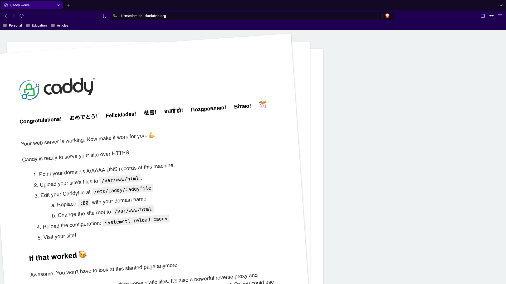
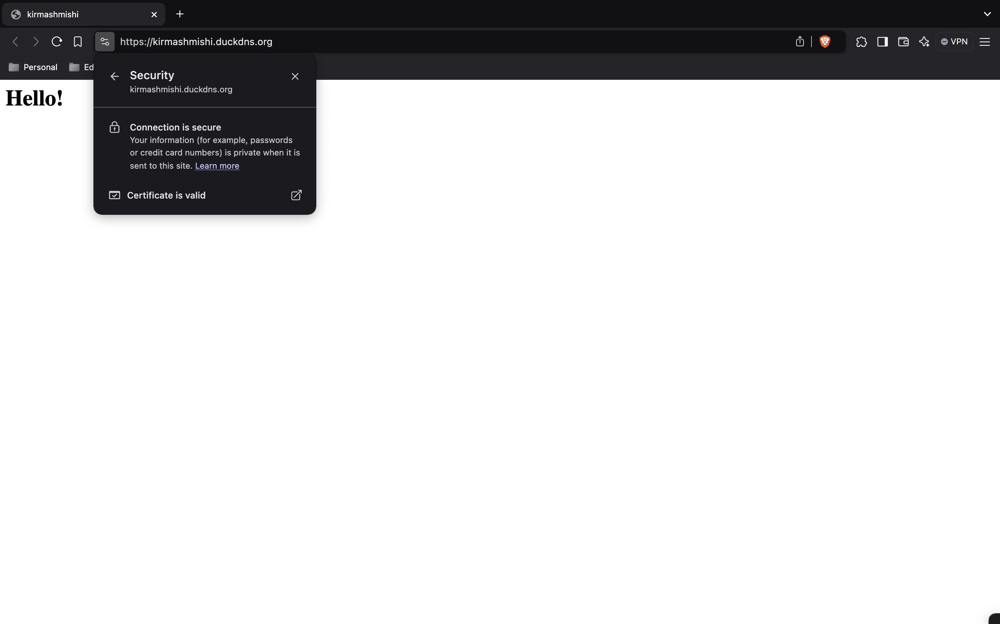

# Лабораторная работа №2

Ansible + Caddy

## Задача

На целевом сервере установить Ansible и вебсервер Caddy

## Ход работы

1. Локально устанавливаем pip менеджер и далее Ansible.

2. Создаем файлы конфигурации ansible.cfg и inventory/hosts. В inventory/hosts прописываем данные от удаленного сервера:
   
3. Подключаемся к клиенту командами ansible my_servers -m ping и ansible my_servers -m setup: 2.png
   
4. Инициализируем локально конфигурационное "дерево" и наполним файл с шагами, которые будут выполняться в плейбуке, а
   также добавим шаги создания и удаления файла (задание 1):

```yaml
---
- name: Create test file # создаем новый файл
  ansible.builtin.shell:
    cmd: echo task_test_file_content > $HOME/test.txt

- name: Check file # проверяем содержимое файла
  command: "cat {{ ansible_env.HOME }}/test.txt"
  register: file_check
  failed_when: "'task_test_file_content' not in file_check.stdout"

- name: Change the content of the file # изменяем содержимое файла
  shell: "echo task_new_test_file_content > {{ ansible_env.HOME }}/test.txt"
  when: file_check is succeeded

- name: Delete test file # удаляем файл
  ansible.builtin.shell:
    cmd: rm $HOME/test.txt

- name: Install prerequisites
  apt:
    pkg:
      - debian-keyring
      - debian-archive-keyring
      - apt-transport-https
      - curl

- name: Add key for Caddy repo
  apt_key:
    url: https://dl.cloudsmith.io/public/caddy/stable/gpg.key
    state: present
    keyring: /usr/share/keyrings/caddy-stable-archive-keyring.gpg

- name: add Caddy repo
  apt_repository:
    repo: "deb [signed-by=/usr/share/keyrings/caddy-stable-archive-keyring.gpg] https://dl.cloudsmith.io/public/caddy/stable/deb/debian any-version main"
    state: present
    filename: caddy-stable

- name: add Caddy src repo
  apt_repository:
    repo: "deb-src [signed-by=/usr/share/keyrings/caddy-stable-archive-keyring.gpg] https://dl.cloudsmith.io/public/caddy/stable/deb/debian any-version main"
    state: present
    filename: caddy-stable

- name: Install Caddy webserver
  apt:
    name: caddy
    update_cache: yes
    state: present

- name: Create config file
  template:
    src: templates/Caddyfile.j2 # Откуда берем
    dest: /etc/caddy/Caddyfile # Куда кладем

- name: Reload with new config
  service:
    name: caddy
    state: reloaded
```

5. Далее инициализируем файл конфигурации самого плейбука:

```yaml
---
- name: Install and configure Caddy webserver
  hosts: my_servers

  roles:
    - caddy_deploy
```

6. Создадим шаблон (Jinja2) и переменные для того, чтобы запустить Caddy. Также зарегистрируем
   домен https://kirmashmishi.duckdns.org.
7. Запустим плейбук и проверим работоспособность:
   

## Задания

### Задание 1

Добавим в playbook следующие шаги:

```yaml
- name: Create test file # создаем новый файл
  ansible.builtin.shell:
    cmd: echo task_test_file_content > $HOME/test.txt

- name: Check file # проверяем содержимое файла
  command: "cat {{ ansible_env.HOME }}/test.txt"
  register: file_check
  failed_when: "'task_test_file_content' not in file_check.stdout"

- name: Change the content of the file # изменяем содержимое файла
  shell: "echo task_new_test_file_content > {{ ansible_env.HOME }}/test.txt"
  when: file_check is succeeded

- name: Delete test file # удаляем файл
  ansible.builtin.shell:
    cmd: rm $HOME/test.txt
```

### Задание 2

Чтобы теперь видеть кастомную страницу при переходе на домен, изменим playbook и шаблон Caddyfile:

Caddyfile:

```
{{ domain_name }} {
    root * /var/www/html
    file_server

    log {
        output file {{ log.file }}
        format json
        level {{ log.level }}
    }
}
```

Добавим следующие этапы в playbook:

```yaml
- name: Create /var/www/html directory
  file:
    path: /var/www/html
    state: directory
    owner: www-data
    group: www-data
    mode: "0755"

- name: Create index.html
  copy:
    content: |
      <html>
        <head>
          <title>kirmashmishi</title>
        </head>
        <body>
          <h1>Hello!</h1>
        </body>
      </html>
    dest: /var/www/html/index.html
    owner: www-data
    group: www-data
    mode: "0664"
```

Запустим плейбук и теперь можем видеть нашу страницу:

