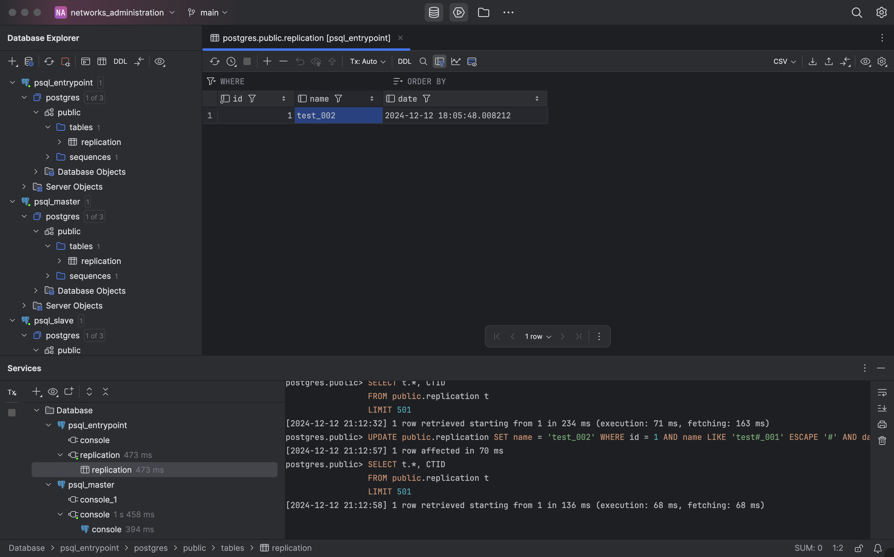

# Лабораторная работа №3

HA Postgres Cluster

## Задача

Развернуть и настроить высокодоступный кластер Postgres.


## Ход работы

1. На виртуальной машине устанавливает Docker.
2. Подготовим инфраструктуру под кластер: создадим Dockerfile с образом PostgreSQL, внутри которого установлены нужные зависимости, docker-compose файл для деплоя, конфиги PostgreSQL для Patroni. Пример postgres1.yml:

```yaml
scope: my_cluster
name: postgresql1

restapi:
  listen: pg-slave:8008
  connect_address: pg-slave:8008

zookeeper:
  hosts:
    - zoo:2181

postgresql:
  listen: 0.0.0.0:5432
  connect_address: pg-slave:5432
  data_dir: /var/lib/postgresql/data/postgresql1
  bin_dir: /usr/lib/postgresql/15/bin
  pgpass: /tmp/pgpass1
  authentication:
    replication:
      username: replicator
      password: rep-pass
    superuser:
      username: postgres
      password: postgres
  parameters:
    unix_socket_directories: "."

watchdog:
  mode: off

tags:
  nofailover: false
  noloadbalance: false
  clonefrom: false
  nosync: false
```

3. Деплоим:
   
4. Создаем таблицу в мастер-ноде и добавляем данные:
   
5. Проверяем данные и в мастер-ноде, и в slave-ноде:
   
   
6. Проверим, можно ли изменить данные в slave-ноде:
   
7. Теперь добавим балансировку трафика с помощью HAproxy.

```yaml
global
    maxconn 100

defaults
    log global
    mode tcp
    retries 3
    timeout client 30m
    timeout connect 4s
    timeout server 30m
    timeout check 5s

listen stats
    mode http
    bind *:7000
    stats enable
    stats uri /

listen postgres
    bind *:5432 # Выбранный порт из docker-compose.yml
    option httpchk
    http-check expect status 200 # Описываем нашу проверку доступности (в данном случае обычный HTTP-пинг)
    default-server inter 3s fall 3 rise 2 on-marked-down shutdown-sessions
    server postgresql_pg_master_5432 pg-master:5432 maxconn 100 check port 8008 # Адрес первой ноды постгреса
    server postgresql_pg_slave_5432 pg-slave:5432 maxconn 100 check port 8008 # Адрес второй ноды постгреса
```

8. Проверим доступность через клиент БД:
   
9. Теперь поменяем данные через pg-entrypoint:
   
   Данные поменялись успешно.

## Задание

- Любым способом выключаем доступ до ноды, которая сейчас является мастером (например, через docker stop). Некоторое время ждем, после этого анализируем логи и так же пытаемся считать/записать что-то в БД через entrypoint подключение. Затем необходимо расписать, получилось или нет, а так же объяснить, что в итоге произошло после принудительного выключения мастера (со скриншотами)

1. Выключим мастер-ноду:
   
   
2. Попробуем поменять данные через pg-entrypoint:
   

По логам видно, что slave-нода потеряла подключение к master-ноде. Zoo и HAproxy тоже не могут "достучаться" до master-ноды, поэтому HAproxy slave-нода стала новым мастером, теперь через slave-ноду можно и читать, и записывать.

## Вопросы

1. Порты 8008 и 5432 вынесены в разные директивы, expose и ports. По сути, если записать 8008 в ports, то он тоже станет exposed. В чем разница?

**Expose** объявляет, что контейнер использует определённый порт внутри своей сети. Это позволяет другим контейнерам в той же сети подключаться к нему, однако порт остаётся недоступным извне контейнера и не публикуется на хосте. **Ports** публикует порт контейнера на хосте, создавая сопоставление между портом хоста и портом внутри контейнера. Это делает контейнер доступным для внешних приложений и пользователей.

2. При обычном перезапуске композ-проекта, будет ли сбилден заново образ? А если предварительно отредактировать файлы postgresX.yml? А если содержимое самого Dockerfile? Почему?

- При перезапуске docker-compose с помощью `up`, `restart` контейнеры пересобраны не будут, потому что Docker Compose использует уже ранее созданный образ.
- Изменение файла, который используется для сборки образа, не приведет к пересборке образа, так как эти файлы копируются в ранее созданный образ, соответственно, для того, чтобы изменения в образах подействовали, надо пересобрать образ.
- Если изменить содержимое Dockerfile, то при следующем запуске через `docker-compose up`, контейнер пересоберется, так как Docker Compose отслеживает изменения в Dockerfiles, которые использует.

Если есть потребность в пересборке docker-compose проекта, в котором не было изменений, можно использовать флаг `--build`.
